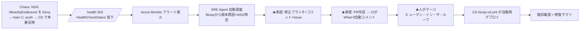

# SRE Agent ライブデモ — 「インフラ・インシデント → PR → 再デプロイ → 解消」

`ozahiro0116/demoIaC`（App Service + SQL Database / AVM Bicep + GitHub Actions）を使い、
**Azure SRE Agent がインフラ障害を自動調査 → 修正 PR → 人の承認 → 自動再デプロイ → 復旧**する
ループをライブで実演するための一式です。

## シナリオ
「セキュリティ強化のつもりで App Service サブネットの**送信規則を1行締めた**ら、本番の
Web App → SQL Database 接続が落ちた」——インフラ現場で定番の事故を再現し、SRE Agent が
`web-sql-network.bicep` の NSG 設定ミスを特定して修正 PR を出します。



## なぜ成立するか（確認済みの事実）
- リポジトリは **GitOps 完成済み**: PR→`bicep-ci.yml`(What-If)→main マージ→`bicep-cd.yml`(自動デプロイ)。
- SRE Agent は **IaC(Bicep) を解析**し、**Issue/PR 作成・GitHub Actions 起動/追跡**が可能
  （[GitHub connector](https://learn.microsoft.com/azure/sre-agent/github-connector)）。
- インシデント時に **コード編集→新ブランチへ push→PR** まで実行
  （[Automate incidents](https://learn.microsoft.com/azure/sre-agent/automate-incidents)）。
- **人の承認なしに本番適用しない**（[Overview](https://learn.microsoft.com/azure/sre-agent/overview)）。本デモは Review モード。

## 進め方（この順に読む）
1. [docs/01-setup.md](docs/01-setup.md) — 環境準備（インフラ・アプリ・アラート）
2. [docs/02-connect-sre-agent-github.md](docs/02-connect-sre-agent-github.md) — SRE Agent 作成と GitHub/Azure 接続
3. [docs/03-runbook-sql-connectivity.md](docs/03-runbook-sql-connectivity.md) — Runbook（エージェントに登録）
4. [chaos/chaos-nsg-block-sql.md](chaos/chaos-nsg-block-sql.md) — 障害注入（本番直前）
5. [docs/04-demo-script.md](docs/04-demo-script.md) — 当日の進行台本
6. [docs/05-cleanup.md](docs/05-cleanup.md) — 後片付け

## フォルダ構成
```
sre-agent-demo/
├─ README.md                         ← 本書
├─ app/                              ← サンプルアプリ (.NET 8 / /health で SQL 到達性)
│  ├─ SreDemoApp.csproj
│  ├─ Program.cs
│  └─ Properties/launchSettings.json
├─ app-deploy/
│  ├─ deploy-app.ps1                 ← アプリ配置 + /health ヘルスチェック設定（一回限り）
│  └─ app-cd.yml                     ← 任意: アプリ専用 CD ワークフロー
├─ alerts/
│  ├─ healthcheck-alert.bicep        ← HealthCheckStatus メトリックアラート
│  └─ deploy-alert.ps1               ← 同 CLI 版
├─ chaos/
│  └─ chaos-nsg-block-sql.md         ← 障害注入（NSG を Deny）+ 戻し方
└─ docs/
   ├─ 01-setup.md
   ├─ 02-connect-sre-agent-github.md
   ├─ 03-runbook-sql-connectivity.md
   ├─ 04-demo-script.md
   └─ 05-cleanup.md
```

## 対象リソース（dev / eastus2 / RG=`rg-web-sql-dev-eus2`）
| 種別 | 名前 |
| --- | --- |
| Web App | `app-web-sql-dev-eus2` |
| App Service Plan | `asp-web-sql-dev-eus2`（B1） |
| SQL Server | `sql-web-sql-dev-eus2.database.windows.net`（publicNetworkAccess=Disabled） |
| SQL DB | `sqldb-web-sql-dev-eus2` |
| VNet | `vnet-web-sql-dev-eus2` |
| NSG(AppSvc) | `nsg-appsvc-web-sql-dev-eus2` ← **障害注入の対象** |
| NSG(PE) | `nsg-pe-web-sql-dev-eus2` |
| App Insights | `appi-web-sql-dev-eus2` |
| Log Analytics | `log-web-sql-dev-eus2` |

## 配置について
本フォルダは `ozahiro0116/demoIaC` リポジトリ直下に `sre-agent-demo/` として置くことを想定しています
（`app-deploy/app-cd.yml` は使うなら `.github/workflows/app-cd.yml` へコピー）。
SRE Agent はリポジトリ全体を参照するため、Runbook やアプリも同居していて問題ありません。

## 注意（正確性のための補足）
- このリポジトリは **IaC 専用**で、修正は常に「IaC/構成の修正」になります（今回の狙いに合致）。
- `/health` は SQL への **TCP 到達性**のみ検査します（DB ログインはしない）。
  MI への DB ユーザー付与なしで決定論的に再現するための設計です。
- UI 文言・メトリック名はプレビューで変わり得ます。差異があれば公式ドキュメントに従ってください。
